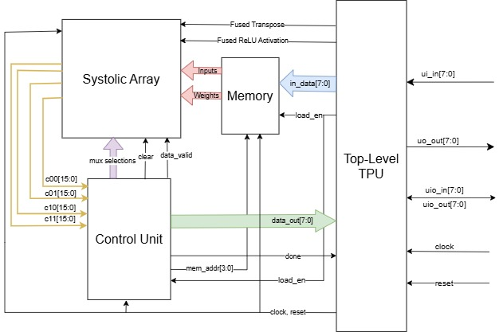

# Tensor Processing Unit Version 2

Background:

- After reading Elon Musk discuss the efficiency trade-offs between integer and floating-point computation for Tesla AI5/AI6 chips in an [X thread](https://x.com/elonmusk/status/1987885633004831109), I thought of testing the idea myself using free ASIC tools on Tiny Tapeout.
- Since I already have a fully-fledged [TPU](https://github.com/WilliamZhang20/ECE298A-TPU) that does 8-bit integer (INT8) arithmetic we only just convert some logic to FP8 and make sure everything else works.
- With the previous project, I had tried doing FP8 with BF16 accumulation, but the chip area blew up. In retrospect, this was likely because I took extra space converting BF16 to FP8 for 8-bit ouptuts.
- Later on in the previous project, I got rid of 8-bit outputs and kept every output in 16-bit numbers. So with back-conversion waste eliminated, time to try it out again.

Results:
- Found different ways of implementing floating point logic for FP8 to BF16:
    - Fused Multiply-Add for direct FP8 -> BF16 - requires an BF16 adder which can be tough and complex circuitry
    - Simpler way - accumulate the FP8 product in an integer and then convert back to float. According to @cchan, this is also implemented in NVIDIA H100.
- Optimized the datapath by merging the old project's `mmu_feeder` and `control_unit` into a single module `control_unit`.
- Have come up with plans for adding a second instruction for elementwise multiplications! It takes the same number of I/O cycles and is also handy with a systolic array!

- [Read the documentation for project](docs/info.md)

## Design Architecture

High Level Block Diagram:

## Verification Infrastructure

Currently two tests are available, and both pass:
1. Testing the precision of the MAC unit of the systolic array with randomly generated inputs from -10 to 10. 
2. Testing the functional accuracy of the matrix multiplication.

## What is Tiny Tapeout?

Tiny Tapeout is a project that makes it easy and chip to get digital and analog designs manufactured on a real chip.

To learn more, visit https://tinytapeout.com.

My Verilog code of the Application-Specific Integrated Circuit (ASIC) logic is defined in `/src`, and upon uploading to GitHub, each commit triggers a GitHub action.

The GitHub action will automatically build the ASIC files using [LibreLane](https://www.zerotoasiccourse.com/terminology/librelane/).

This action transforms the chip logic from software code to wired connections between transistors on the chip, allowing for designers to [view the chip](https://williamzhang20.github.io/TPUv2/) form when it is etched on the silicon die. 

Moreover, it enables logical and physical pre-silicon verification to ensure it works after tapeout. Due to ASIC indelibleness, the chip must work when taped out or else it is thrown away.